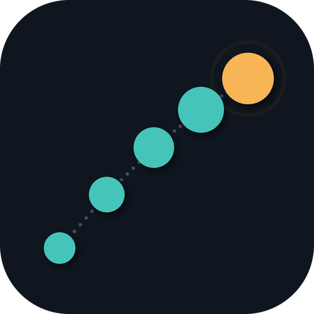

<p align="center">
  
</p>

<h1 align="center">HiddenSteps</h1>

<p align="center"><em>Watches how you work. Tells you what it noticed. Never touches your keyboard.</em></p>

---

## What it is

HiddenSteps is a local-first desktop app that pays attention to your ordinary, repeated work — which apps you jump between, what keeps getting copied from one place to another, which five steps you do every single morning — and tells you, in plain language, what it noticed and what your real options are.

It is **not** an AI agent. It does not click things, fill in forms, or run scripts on your behalf. It watches, it explains, and then it gets out of the way. What you do with what it finds is entirely up to you — a keyboard shortcut, a five-line script, an n8n flow, an RPA bot, or nothing at all, because sometimes the honest answer is "this isn't worth automating."

> Read [why it matters](docs/research/02-market-gaps-and-differentiation.md) if you want the longer version.

## What it can do

- **Notice repeated work** — the same sequence of apps, actions, or file operations recurring across days or weeks, not just within one session.
- **Explain itself** — every recommendation states *why* it was suggested, *how confident* HiddenSteps is, *what it assumed*, and *what it deliberately ignored*. Numbers like "you did this 31 times" always trace back to real observed events, never to something an AI model made up — see [how that's enforced](crates/README.md).
- **Span the whole solution space** — a suggestion can be as small as "there's a keyboard shortcut for that" or as involved as "here's a hybrid script + local-LLM approach," with the tradeoffs of each laid out side by side.
- **Run entirely offline** — local AI models (via [Ollama](https://ollama.com) and friends) by default; cloud providers are opt-in, per-provider, and never see anything above the privacy level you've chosen.
- **Show you exactly what it's watching, in real time** — a live feed of what was just captured (after redaction), one-click pause, one-click delete-everything, and an audit log of every privacy-relevant change it's made.
- **Redact before it remembers anything** — passwords, API keys, credit card numbers, and other secret-shaped text are stripped before anything touches disk; if it's not sure, it drops the observation entirely rather than guess.

## What it deliberately won't do

- Record your screen or keystrokes by default.
- Take any action without you explicitly approving it, every time.
- Send anything to the cloud unless you've turned that on, provider by provider.
- Report anything to an employer, IT admin, or anyone but you — there is no "manager view," and there never will be one. See [why](docs/research/04-ethical-analysis.md).
- Require an account, a subscription, or an internet connection to work.

## Privacy levels, at a glance

| Level | Name | Collects |
|---|---|---|
| 0 | Manual | Nothing. Observation is off. |
| 1 | App awareness | Which app has focus, window titles, shortcuts used. |
| 2 | Workflow awareness | + browser domains, clipboard *metadata* (type/size, never content), file operation metadata. |
| 3 | Context-aware | + fuller in-app and browser context. |
| 4 | Maximum assistance | + optional, explicitly opted-in screen text reading (OCR) — off unless you turn it on. |

Full detail, including exactly what's retained and what could ever leave your device: [docs/design/05-privacy-model.md](docs/design/05-privacy-model.md).

## Status

This is early — the core engine is real, tested, and working; the desktop app around it is partly assembled. Concretely, right now:

- ✅ **The Rust core** — observation, redaction, the classify/redact/summarize pipeline, pattern detection, the recommendation engine, local/cloud AI provider clients, the privacy-dispatch gate, a WASM plugin sandbox, and encrypted local storage — is built and **148 automated tests pass**, several against real backends (a live X11 display, real inotify, a real local Ollama model), not just mocks. Details: [crates/README.md](crates/README.md).
- 🚧 **The desktop app** (Tauri shell + UI) exists as real source wiring the core together, with the onboarding flow, privacy dashboard, recommendations, settings, and diagnostics screens built and tested — but hasn't been packaged into anything installable yet, and the native shell itself hasn't been compiled in this project's dev environment (see below). Details: [apps/desktop/README.md](apps/desktop/README.md).
- 📋 Signed installers, package-manager listings (Winget, Homebrew, Flatpak), and a real release process don't exist yet.

If you want the full paper trail — competitive research, architecture decisions, UX wireframes, and the implementation roadmap — it's all in [`docs/`](docs/), and none of it is fluff: every claim in this README traces back to something in there.

## Building it yourself

There's no downloadable release yet, so "installing" HiddenSteps today means building it from source. Two independent pieces, with different requirements:

### 1. The Rust core (works anywhere Rust does — no extra setup)

```sh
git clone https://github.com/JGalego/HiddenSteps.git
cd HiddenSteps
cargo test --workspace       # 148 tests, ~15s, no system dependencies beyond cargo itself
```

If you have [Ollama](https://ollama.com) running locally, you can also run the tests that hit a real model:

```sh
cargo test -p hiddensteps-llm-provider -- --ignored
```

### 2. The desktop app

The UI builds and tests cleanly on its own:

```sh
cd apps/desktop/ui
npm install
npm test          # 26 tests, real jsdom rendering
npm run dev        # dev server on http://localhost:1420
```

The native shell needs [Tauri's platform prerequisites](https://tauri.app/start/prerequisites/) — on Linux specifically, `webkit2gtk-4.1` and friends via your package manager (this is the one thing this project's own dev sandbox couldn't install, so it's never actually been built — see [apps/desktop/README.md](apps/desktop/README.md) for the honest story):

```sh
cd apps/desktop/src-tauri
cargo build
# once it builds: `cargo tauri dev` from apps/desktop/, with the ui/ dev server running
```

If you get it running somewhere, [an issue or PR](https://github.com/JGalego/HiddenSteps/issues) reporting what broke (or that nothing did) is genuinely useful — this would be the first real compile.

## How it's built

Tauri (Rust core + native OS WebView) over a modular Rust workspace, one crate per responsibility — observation, redaction, the event pipeline, pattern detection, the recommendation engine, LLM providers, the privacy-dispatch gate, a WASM plugin sandbox, enterprise policy — all behind Clean Architecture boundaries, with a single SQLCipher-encrypted file as the only place anything durable lives. Every non-obvious choice has a written rationale: see the [Architecture Decision Records](docs/design/adr/).

```
docs/
  research/   Competitive analysis, market gaps, risk/ethical/privacy analysis, threat model
  design/     PRD, ADRs, system architecture, data flow, trust/privacy/security models, DB schema, plugin & API specs
  ux/         User journeys, onboarding wireframes, privacy dashboard, recommendations UX, settings IA, accessibility
  roadmap/    Milestones, technology choices, testing strategy, security/privacy/performance test plans
crates/       The Rust core — see crates/README.md for exactly what's built and how it's verified
apps/desktop/ The Tauri shell + React/TypeScript UI — see apps/desktop/README.md
.github/workflows/ci.yml  Cross-platform build/test, including the first real compile of the pieces this
                          dev environment couldn't verify itself
```

## Contributing

Genuinely welcome, especially: running the CI-untested pieces (macOS/Windows builds, the Tauri shell) on a real machine and reporting back; a real design pass on the app icon; and filling in any of the disclosed gaps listed throughout `crates/README.md` and `apps/desktop/*/README.md`.

## License

[MIT](LICENSE).
