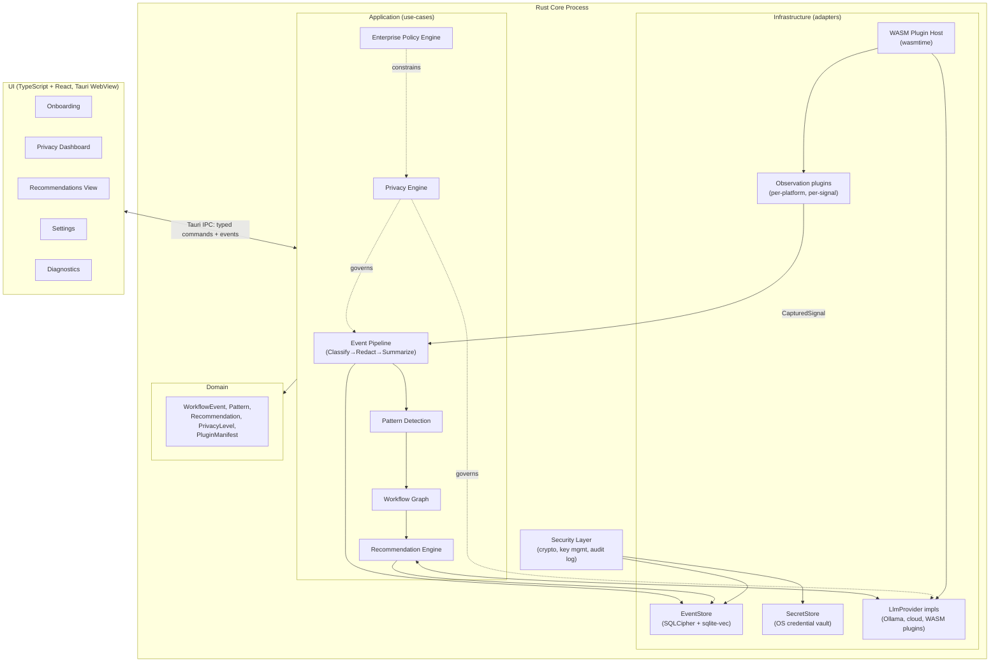

# System Architecture

Implements the module list from PROMPT.md as Rust crates inside the single Tauri core process (ADR-0001, ADR-0002). Layering follows Clean Architecture: domain → application → infrastructure, dependencies point inward only.

## 1. Component diagram

## 2. Module responsibilities

| PROMPT.md module | Crate | Layer | Responsibility | Key ports (traits) |
|---|---|---|---|---|
| Observation Engine | `observation-*` (per platform/signal) | Infrastructure | Capture raw signals per active manifest; never persists raw data itself | `ObservationSource` |
| Event Pipeline | `pipeline` | Application | Classify → Redact → Summarize orchestration (ADR-0006) | `Classifier`, `Redactor`, `Summarizer` |
| Privacy Engine | `privacy` | Application | Enforces privacy-level rules, gates what leaves the pipeline and what may reach a non-local `LlmProvider` | consumes `PrivacyLevel`, wraps calls to `LlmProvider` |
| Redaction Engine | `redaction` | Application (invoked by pipeline) | Detects and strips secrets/PII/PHI/financial identifiers; drop-on-uncertainty | `Redactor` |
| Pattern Detection | `patterns` | Application | Exact sequence matching + `sqlite-vec` similarity search over summary embeddings | `EmbeddingStore`, `EventStore` (read) |
| Workflow Graph | `workflow-graph` | Application | Maintains the graph of detected workflows/transitions over time, feeds Recommendation Engine | `EventStore` |
| Recommendation Engine | `recommendations` | Application | Deterministic layer + LLM synthesis (ADR-0010); enforces the explainability output contract | `LlmProvider`, `EventStore` |
| Knowledge Base | `knowledge-base` | Application | Stores/retrieves reference material for recommendations (tool descriptions, prior user feedback on suggestion categories) | `EventStore` |
| Embedding Layer | `embeddings` | Infrastructure | Wraps `LlmProvider::embed` + `sqlite-vec` read/write | `EmbeddingStore` |
| LLM Provider Layer | `llm-provider` (+ per-provider crates/plugins) | Infrastructure | Implements `LlmProvider` for Ollama, cloud APIs, WASM-hosted third-party providers (ADR-0004) | `LlmProvider` |
| Security Layer | `security` | Infrastructure | Encryption, key management (ADR-0008), signature verification, audit log writer | `SecretStore`, `AuditLog` |
| Plugin Framework | `plugin-host` | Infrastructure | WASM sandbox, manifest verification, capability grant enforcement (ADR-0009) | `PluginHost` |
| Enterprise Policy Engine | `enterprise-policy` | Application | Loads/enforces policy files: privacy-level floors, approved-provider allowlists, air-gapped mode | consumes `PrivacyLevel`, `LlmProvider` allowlist |
| UI | `ui/` (TypeScript/React) | Presentation (outside the Rust core) | Onboarding, dashboard, recommendations view, settings, diagnostics | Tauri IPC commands/events only |

## 3. Cross-cutting concerns

- **Privacy Engine sits in front of every boundary that could leak data**: the pipeline's Redact stage, and every `LlmProvider::complete`/`embed` call. This is the one application-layer module every other application module either calls into or is wrapped by, and it is the natural place to enforce "Deep-mode content never reaches a cloud provider without separate consent" ([../research/05-privacy-analysis.md](../research/05-privacy-analysis.md)).
- **Enterprise Policy Engine constrains, never bypasses, the Privacy Engine.** It can raise the effective privacy-level floor or narrow the allowed-provider set; it has no code path that widens what an individual's data exposes or that grants any external viewer access (per NG2 in [01-prd.md](01-prd.md) and the ethical analysis).
- **Security Layer is a dependency of Infrastructure, not Application.** Application-layer use-cases never touch raw key material or crypto primitives directly; they call `EventStore`/`SecretStore` ports, whose infrastructure implementations depend on the Security Layer. This keeps the dependency-direction rule (ADR-0002) intact for the most sensitive code path in the system.

## 4. UI ↔ core boundary

The UI never gets filesystem, network, or OS-API access directly — only Tauri's typed IPC commands (see [09-api-specification.md](09-api-specification.md)) reaching into the Application layer. This is deliberate: even if the UI's web-tech surface (or a WASM-hosted plugin's rendered contribution to it) is compromised, it cannot reach raw observation data, secrets, or the filesystem except through the same capability-gated, audited path every other caller uses.

## 5. Process and threading model

- Single OS process (Tauri). The Observation Engine's per-platform hooks run on dedicated OS-appropriate threads/event loops (e.g., a Win32 message-loop thread, a macOS run-loop-integrated observer, a Linux AT-SPI/X11-event thread).
- The Event Pipeline runs on a bounded worker pool; Summarize/Embed/Store stages are scheduled at idle time by default (configurable intensity, per PROMPT.md's resource-consumption requirement), Classify/Redact run synchronously per captured signal (ADR-0006).
- The Recommendation Engine's LLM-synthesis step runs asynchronously and is rate-limited/batched — recommendations are not regenerated on every new event, only when the deterministic layer's pattern state changes meaningfully.
