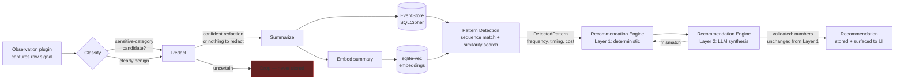
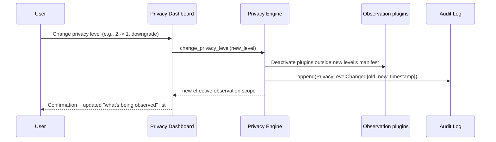
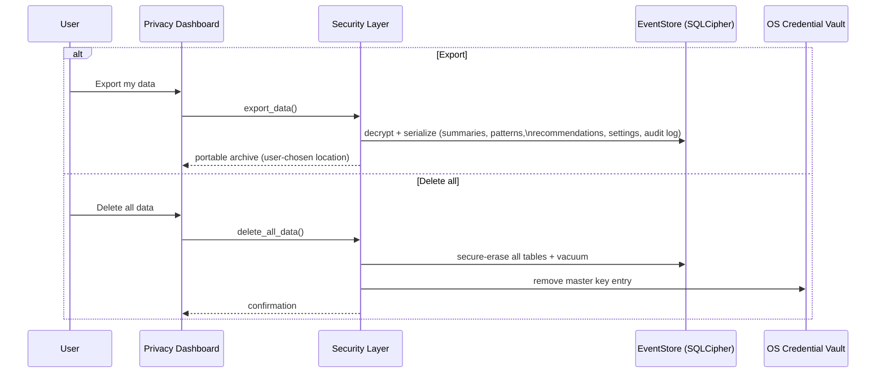
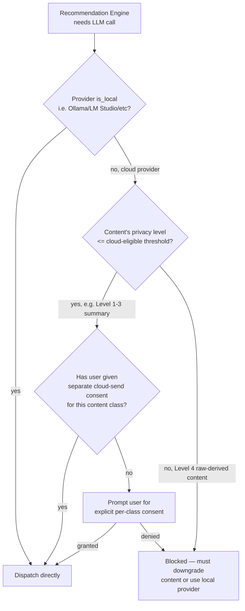

# Data Flow Diagrams

## 1. Capture → recommendation (the core loop)



Raw signal (A) never reaches durable storage (F/G) directly — only the post-Summarize abstraction does, per ADR-0006. The dashed "mismatch" edge is the ADR-0010 validator rejecting an LLM output that altered Layer 1's numeric claims and forcing regeneration.

## 2. Onboarding consent flow

```mermaid
sequenceDiagram
    participant U as User
    participant UI as Onboarding UI
    participant Core as Rust Core

    U->>UI: Launch app (first run)
    UI->>U: Explain what HiddenSteps does / does not do
    UI->>U: Explain each OS permission and why (per privacy level)
    U->>UI: Choose privacy level (0-4)
    UI->>Core: get_provider_detection()
    Core->>Core: Probe Ollama/LM Studio/LocalAI/vLLM,\nscan for llama.cpp; benchmark hardware
    Core-->>UI: Detected local runtimes + hardware suitability
    U->>UI: Choose AI provider (local or cloud)
    alt cloud provider chosen
        UI->>Core: test_provider_connectivity(key, endpoint)
        Core-->>UI: ok / error
    end
    UI->>U: Show final summary: level, provider, exact data scope
    U->>UI: Explicit consent ("Start observing")
    UI->>Core: start_observation(level, provider)
    Core->>Core: Request only the OS permissions\nthis level requires
    Core-->>UI: observation_status = active
```

No `start_observation` call is possible before this sequence completes — enforced by the Application layer refusing the command outside a completed-onboarding state, not just by UI flow order.

## 3. Privacy-level change (at any time post-onboarding)



An **upgrade** (e.g., 1 → 3) follows the same path but re-enters the relevant slice of the onboarding permission-explanation step for any newly-required OS permission before activating the corresponding plugins — a privacy-level increase never silently expands observation.

## 4. Export / delete-all



Delete-all removes the vault key entry as well as the database contents — even a recovered copy of the encrypted file is unusable afterward, satisfying "leaves no traces" for Portable Mode and the general delete-all guarantee (FR-6).

## 5. Cloud-provider dispatch gating



This gate lives in the Privacy Engine (ADR-0004) and wraps every `LlmProvider` call site — the Recommendation Engine cannot bypass it by calling a provider directly.
